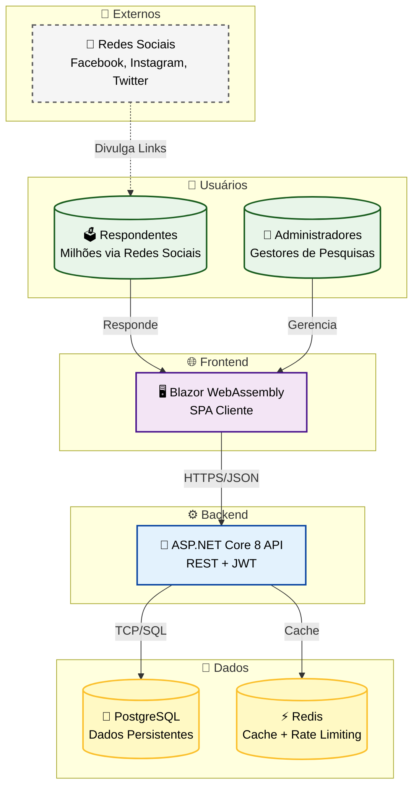
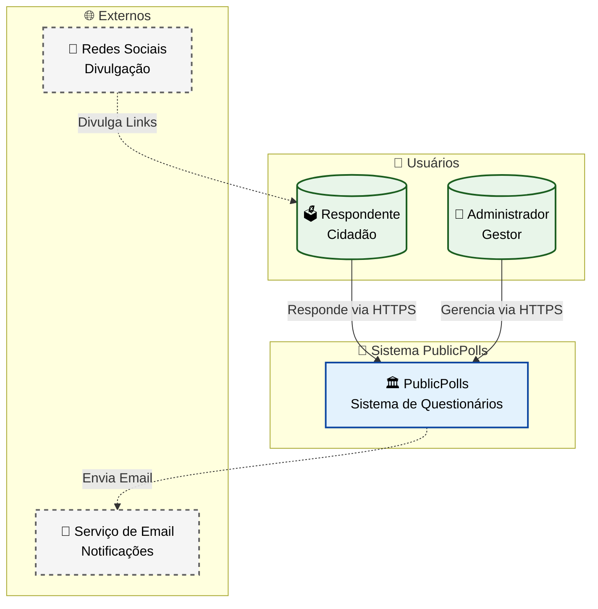
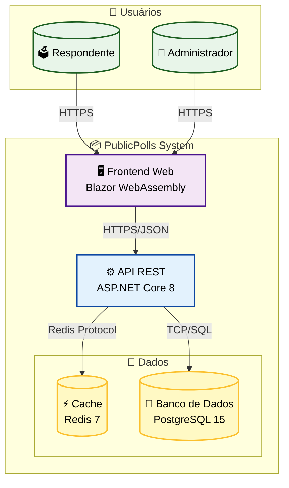
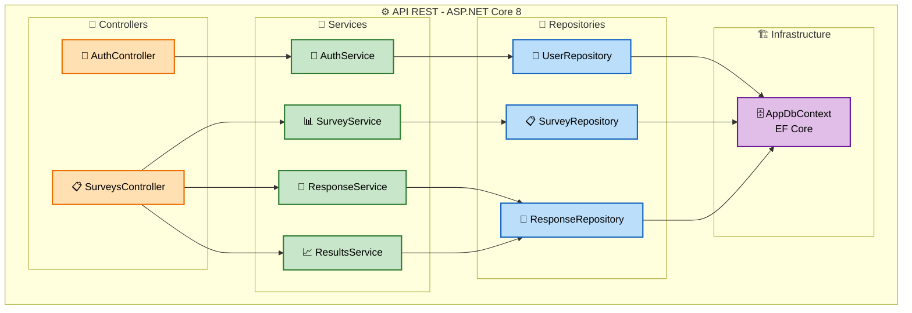
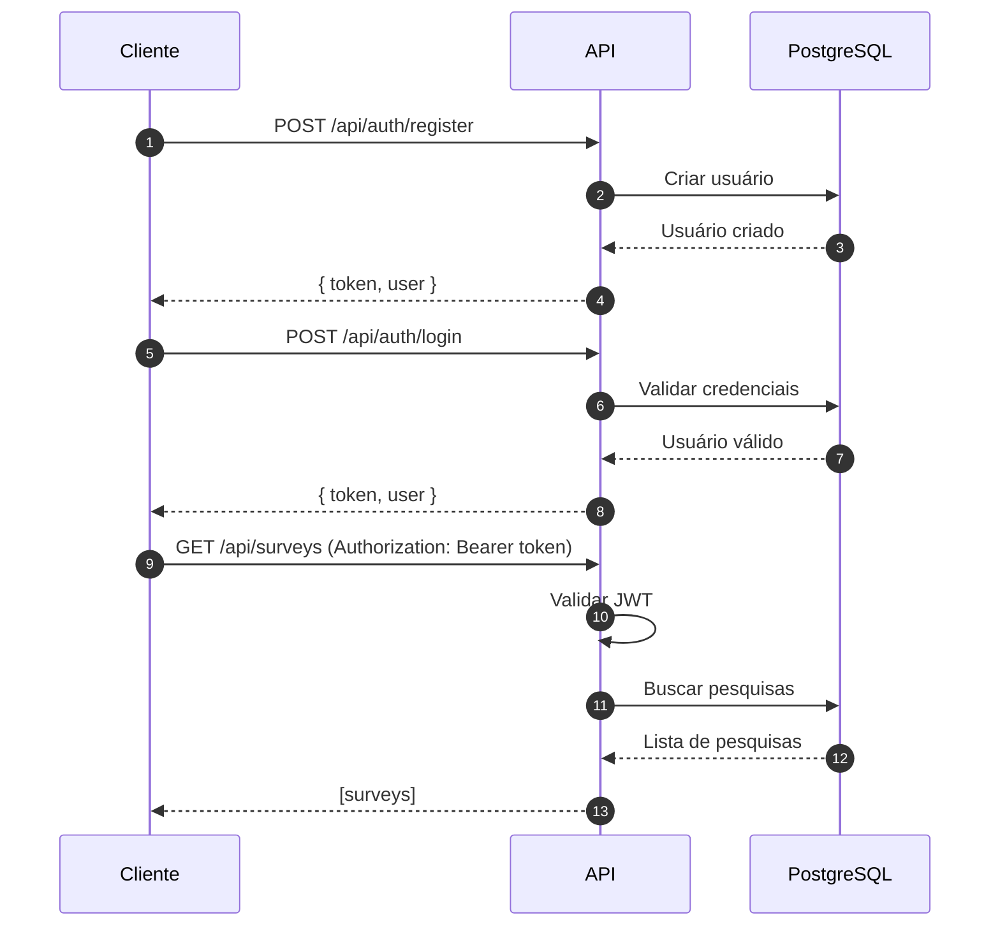

# 🗳️ PublicPolls - Sistema de Questionários Online

<div align="center">


**Sistema de pesquisas públicas para eleições, projetado para escalar para milhões de respondentes.**

[📖 Documentação](#-documentação) · [🚀 Início Rápido](#-início-rápido) · [🏗️ Arquitetura](#-arquitetura) · [📊 API](#-api-endpoints)

</div>

---

## 📚 Documentação do Projeto

> **⚠️ IMPORTANTE:** Todas as decisões arquiteturais, justificativas técnicas e documentação detalhada estão na pasta [`docs/`](./docs/). Consulte os documentos abaixo para entender as escolhas de cada componente do sistema.

### 📁 Documentos Disponíveis

| Documento | Descrição |
|-----------|-----------|
| [📋 01-visao-geral.md](docs/01-visao-geral.md) | Contexto do projeto, requisitos e público-alvo |
| [🏗️ 02-arquitetura-c4.md](docs/02-arquitetura-c4.md) | Diagramas C4 (Contexto, Container, Componentes) |
| [💾 03-modelo-dados.md](docs/03-modelo-dados.md) | Modelo ER, entidades e relacionamentos |
| [⚖️ 04-justificativas-tecnicas.md](docs/04-justificativas-tecnicas.md) | **Justificativas de TODAS as escolhas tecnológicas** |
| [📈 05-escalabilidade.md](docs/05-escalabilidade.md) | Estratégias de escalabilidade e performance |
| [🔌 06-api-reference.md](docs/06-api-reference.md) | Referência completa da API REST |

### 🔷 Swagger UI - Documentação Interativa da API

A API possui **documentação interativa via Swagger/OpenAPI**:

- **URL local**: `http://localhost:5001/swagger`
- **Recursos**:
  - Visualização de todos os endpoints disponíveis
  - Teste de requisições diretamente no navegador
  - Autenticação JWT integrada para testes autenticados
  - Schemas de request/response com exemplos

```bash
# Após iniciar a API, acesse:
# http://localhost:5001/swagger
```

### 🖥️ Frontend - Blazor WebAssembly

O frontend foi desenvolvido com **Blazor WebAssembly**, um componente do .NET Framework que permite:

- **Execução no browser**: C# compilado para WebAssembly
- **SPA (Single Page Application)**: Navegação sem recarregar a página
- **Comunicação com Backend**: Via HTTP usando `HttpClient` (protocolo HTTPS/JSON)
- **Componentes MudBlazor**: UI rica com Material Design

**Testando o Frontend**:
```bash
cd src/PublicPolls.Web
dotnet run
# Acesse: http://localhost:5002
```

---

## 📋 Sobre o Projeto

O **PublicPolls** é uma plataforma completa para criação e gestão de pesquisas públicas, desenvolvida especificamente para atender demandas eleitorais de grande escala. O sistema permite que administradores criem questionários de múltipla escolha, distribuam via redes sociais e visualizem resultados sumarizados em tempo real.

### 🎯 Objetivos de Negócio

- **Pesquisas Eleitorais**: Captar intenção de voto via redes sociais
- **Alta Escala**: Suportar milhões de respostas simultâneas
- **Resultados em Tempo Real**: Dashboard com agregações e percentuais
- **Prazo Crítico**: Entrega antes do período eleitoral

### 👥 Público-Alvo

| Perfil | Necessidade |
|--------|-------------|
| **Respondente** | Responder pesquisas via link público de forma simples |
| **Administrador** | Criar pesquisas, gerenciar perguntas, visualizar resultados |
| **Startup** | Sistema escalável, confiável e entregue no prazo |

---

## 🏗️ Arquitetura

### Visão Geral do Sistema



### Diagrama C4 - Nível 1: Contexto



### Diagrama C4 - Nível 2: Containers



### Diagrama C4 - Nível 3: Componentes da API



---

## 📁 Estrutura do Projeto

```
public-pools-app/
├── 📄 README.md                          # Este arquivo
├── 📄 PublicPolls.sln                    # Solution Visual Studio
├── 🐳 docker-compose.yml                 # PostgreSQL + Redis
├── 🐳 Dockerfile.api                     # Build da API
├── 🐳 Dockerfile.web                     # Build do Frontend
├── 📄 nginx.conf                         # Servidor web Blazor
│
├── 📂 docs/                              # Documentação detalhada
│   ├── 01-visao-geral.md                 # Visão geral e contexto
│   ├── 02-arquitetura-c4.md              # Diagramas C4 detalhados
│   ├── 03-modelo-dados.md                # Modelo ER e entidades
│   ├── 04-justificativas-tecnicas.md     # Decisões arquiteturais
│   ├── 05-escalabilidade.md              # Estratégias de escala
│   ├── 06-api-reference.md               # Referência da API
│   └── PublicPolls.postman_collection.json
│
├── 📂 src/
│   ├── 📂 PublicPolls.Domain/            # Camada de Domínio
│   │   ├── 📂 Entities/                  # User, Survey, Question, Option, Response, Answer
│   │   └── 📂 Interfaces/                # ISurveyRepository, IResponseRepository, IUserRepository
│   │
│   ├── 📂 PublicPolls.Application/       # Camada de Aplicação
│   │   └── 📂 Services/                  # AuthService, SurveyService, ResponseService, ResultsService
│   │
│   ├── 📂 PublicPolls.Infrastructure/    # Camada de Infraestrutura
│   │   ├── 📂 Data/                      # AppDbContext (EF Core)
│   │   └── 📂 Repositories/              # Implementações dos repositórios
│   │
│   ├── 📂 PublicPolls.API/               # API REST
│   │   ├── 📂 Controllers/               # AuthController, SurveysController
│   │   ├── 📄 Program.cs                 # Configuração DI, JWT, Swagger
│   │   └── 📄 appsettings.json           # Configurações
│   │
│   └── 📂 PublicPolls.Web/               # Frontend Blazor
│       ├── 📂 Pages/                     # Razor pages
│       ├── 📂 Services/                  # HTTP clients
│       ├── 📂 Shared/                    # Layouts
│       └── 📂 wwwroot/                   # Assets estáticos
│
└── 📂 tests/
    └── 📂 PublicPolls.Tests/             # Testes unitários e integração
```

---

## 🚀 Início Rápido

### Pré-requisitos

- [.NET 8 SDK](https://dotnet.microsoft.com/download/dotnet/8.0)
- [Docker Desktop](https://www.docker.com/products/docker-desktop/)

### 1️⃣ Iniciar Infraestrutura

```bash
# Subir PostgreSQL e Redis
docker-compose up -d
```

### 2️⃣ Restaurar Dependências

```bash
dotnet restore
```

### 3️⃣ Executar API

```bash
cd src/PublicPolls.API
dotnet run
```
> 🌐 API disponível em: https://localhost:5001
> 📚 Swagger UI: https://localhost:5001/swagger

### 4️⃣ Executar Frontend

```bash
cd src/PublicPolls.Web
dotnet run
```
> 🖥️ Frontend disponível em: https://localhost:5002

---

## 📊 API Endpoints

### Fluxo de Autenticação



### Endpoints Disponíveis

| Método | Endpoint | Descrição | Auth |
|--------|----------|-----------|------|
| `POST` | `/api/auth/register` | Registrar novo administrador | ❌ |
| `POST` | `/api/auth/login` | Autenticar e obter JWT | ❌ |
| `GET` | `/api/surveys` | Listar pesquisas do usuário | ✅ JWT |
| `POST` | `/api/surveys` | Criar nova pesquisa | ✅ JWT |
| `GET` | `/api/surveys/{id}` | Detalhes de uma pesquisa | ✅ JWT |
| `PUT` | `/api/surveys/{id}` | Atualizar pesquisa | ✅ JWT |
| `DELETE` | `/api/surveys/{id}` | Remover pesquisa | ✅ JWT |
| `GET` | `/api/surveys/{url}/public` | Pesquisa pública (respondente) | ❌ |
| `POST` | `/api/surveys/{id}/responses` | Submeter resposta | ❌ |
| `GET` | `/api/surveys/{id}/results` | Resultados sumarizados | ✅ JWT |

---

## 🔧 Stack Tecnológico

```mermaid
graph TB
    root("🚀 PublicPolls")
    
    subgraph "⚙️ Backend"
        BE_CORE["ASP.NET Core 8"]
        BE_FEAT1["Controllers REST"]
        BE_FEAT2["JWT Authentication"]
        BE_FEAT3["Swagger/OpenAPI"]
        
        BE_DATA["Entity Framework Core"]
        BE_DB["PostgreSQL Provider"]
        BE_MIG["Migrations"]
        
        BE_CACHE["Redis"]
        BE_C1["Caching"]
        BE_C2["Rate Limiting"]
    end
    
    subgraph "🖥️ Frontend"
        FE_CORE["Blazor WebAssembly"]
        FE_F1["C# no Browser"]
        FE_F2["SPA"]
        
        FE_UI["MudBlazor"]
        FE_U1["Material Design"]
        FE_U2["Componentes Prontos"]
    end
    
    subgraph "🏗️ Infrastructure"
        INF_DOCKER["Docker"]
        INF_D1["Compose"]
        INF_D2["Multi-stage Builds"]
        
        INF_PG["PostgreSQL 15"]
        INF_P1["ACID"]
        INF_P2["JSON Support"]
        
        INF_RD["Redis 7"]
        INF_R1["In-Memory Cache"]
    end

    root --> BE_CORE
    root --> FE_CORE
    root --> INF_DOCKER

    BE_CORE --> BE_FEAT1
    BE_CORE --> BE_FEAT2
    BE_CORE --> BE_FEAT3
    BE_CORE --> BE_DATA
    BE_CORE --> BE_CACHE
    
    BE_DATA --> BE_DB
    BE_DATA --> BE_MIG
    
    BE_CACHE --> BE_C1
    BE_CACHE --> BE_C2

    FE_CORE --> FE_F1
    FE_CORE --> FE_F2
    FE_CORE --> FE_UI
    
    FE_UI --> FE_U1
    FE_UI --> FE_U2

    INF_DOCKER --> INF_D1
    INF_DOCKER --> INF_D2
    INF_DOCKER --> INF_PG
    INF_DOCKER --> INF_RD
    
    INF_PG --> INF_P1
    INF_PG --> INF_P2
    
    INF_RD --> INF_R1

    %% Styling
    classDef root fill:#212121,stroke:#000,color:#fff,stroke-width:2px;
    classDef backend fill:#e3f2fd,stroke:#1565c0,color:#000,stroke-width:2px;
    classDef frontend fill:#f3e5f5,stroke:#7b1fa2,color:#000,stroke-width:2px;
    classDef infra fill:#e8f5e9,stroke:#2e7d32,color:#000,stroke-width:2px;
    
    class root root;
    class BE_CORE,BE_FEAT1,BE_FEAT2,BE_FEAT3,BE_DATA,BE_DB,BE_MIG,BE_CACHE,BE_C1,BE_C2 backend;
    class FE_CORE,FE_F1,FE_F2,FE_UI,FE_U1,FE_U2 frontend;
    class INF_DOCKER,INF_D1,INF_D2,INF_PG,INF_P1,INF_P2,INF_RD,INF_R1 infra;
```



---

## 📖 Documentação

| Documento | Descrição |
|-----------|-----------|
| [📋 Visão Geral](docs/01-visao-geral.md) | Contexto, objetivos e requisitos |
| [🏗️ Arquitetura C4](docs/02-arquitetura-c4.md) | Diagramas detalhados C4 Model |
| [💾 Modelo de Dados](docs/03-modelo-dados.md) | Entidades e relacionamentos |
| [⚖️ Justificativas Técnicas](docs/04-justificativas-tecnicas.md) | Decisões arquiteturais |
| [📈 Escalabilidade](docs/05-escalabilidade.md) | Estratégias para milhões de usuários |
| [🔌 Referência da API](docs/06-api-reference.md) | Documentação completa da API |

---

## 🧪 Testes

O projeto demonstra como os componentes podem ser testados através de:

### Testes Unitários
```bash
# Executar todos os testes
dotnet test

# Com cobertura
dotnet test --collect:"XPlat Code Coverage"
```

### Testes via Swagger
A API pode ser testada diretamente no Swagger UI:
1. Acesse `http://localhost:5001/swagger`
2. Execute endpoints públicos (registro, login)
3. Obtenha o token JWT
4. Use o botão "Authorize" para testar endpoints protegidos

### Testes do Frontend
```bash
cd src/PublicPolls.Web
dotnet run
# Acesse http://localhost:5002 e navegue pelas funcionalidades
```

---

## ✅ Conformidade com Requisitos Acadêmicos

Esta seção demonstra como o projeto atende aos critérios de avaliação:

### 1️⃣ Arquitetar e implementar serviços com a plataforma .NET

| Critério | Atendimento | Documentação |
|----------|-------------|--------------|
| Componentes do .NET Framework | ✅ ASP.NET Core 8, Entity Framework Core, JWT Bearer | [Program.cs](src/PublicPolls.API/Program.cs) |
| Funcionamento via componentes .NET | ✅ Controllers, Services, Repositories, Middleware | [02-arquitetura-c4.md](docs/02-arquitetura-c4.md) |
| Componentes atendem requisitos | ✅ Autenticação JWT, CRUD via EF Core, Cache Redis | [04-justificativas-tecnicas.md](docs/04-justificativas-tecnicas.md) |
| Justificativa das escolhas | ✅ Cada tecnologia justificada para DEVs e Stakeholders | [04-justificativas-tecnicas.md](docs/04-justificativas-tecnicas.md) |

### 2️⃣ Arquitetar e implementar sistemas Web com ASP.NET

| Critério | Atendimento | Documentação |
|----------|-------------|--------------|
| Componente adequado para frontend | ✅ **Blazor WebAssembly** - SPA em C# | [PublicPolls.Web](src/PublicPolls.Web/) |
| Linguagem adequada para stakeholders | ✅ Justificativas em linguagem acessível | [04-justificativas-tecnicas.md](docs/04-justificativas-tecnicas.md) |
| Como testar o componente web | ✅ Via navegador em localhost:5002 | [Início Rápido](#-início-rápido) |
| Forma de testar componentes | ✅ Swagger UI para API + Frontend manual | [Testes](#-testes) |

### 3️⃣ Arquitetar e implementar acesso a dados com Entity Framework

| Critério | Atendimento | Documentação |
|----------|-------------|--------------|
| Entity Framework escolhido | ✅ **Entity Framework Core 8** com PostgreSQL | [AppDbContext.cs](src/PublicPolls.Infrastructure/Data/AppDbContext.cs) |
| Relação com solução do requisito | ✅ Mapeamento de entidades, relacionamentos, queries | [03-modelo-dados.md](docs/03-modelo-dados.md) |
| Justificativa da escolha | ✅ Provider oficial, migrations, performance | [04-justificativas-tecnicas.md](docs/04-justificativas-tecnicas.md) |
| Como testar no diagrama | ✅ Diagramas C4 mostram fluxo de dados | [02-arquitetura-c4.md](docs/02-arquitetura-c4.md) |

### 4️⃣ Arquitetar e implementar integração back-end .NET com tecnologias front-end

| Critério | Atendimento | Documentação |
|----------|-------------|--------------|
| Relação frontend/backend | ✅ Blazor WASM ↔ ASP.NET Core API | [Diagrama de Containers](#visão-geral-do-sistema) |
| Justificativa do frontend | ✅ Blazor = Tudo em C#, time único | [04-justificativas-tecnicas.md](docs/04-justificativas-tecnicas.md) |
| Justificativa do backend | ✅ ASP.NET Core = Performance, ecossistema | [04-justificativas-tecnicas.md](docs/04-justificativas-tecnicas.md) |
| Protocolo de comunicação | ✅ **HTTPS/JSON** via REST API | [06-api-reference.md](docs/06-api-reference.md) |

---

## 📄 Licença

Projeto desenvolvido para fins acadêmicos - Arquitetura de Software.

---

<div align="center">

**Desenvolvido com ❤️ usando .NET 8**

</div>
