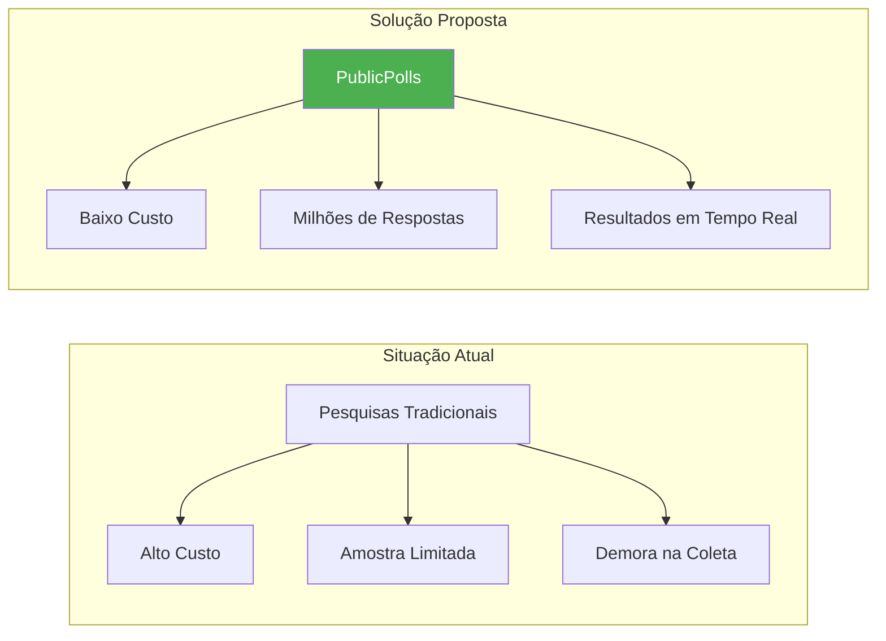
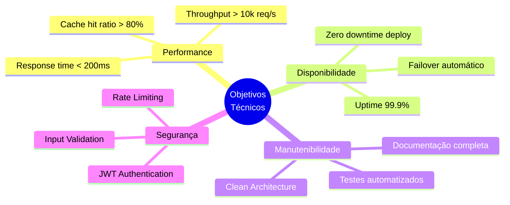
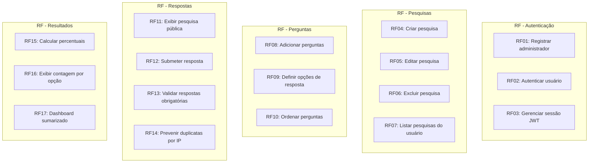
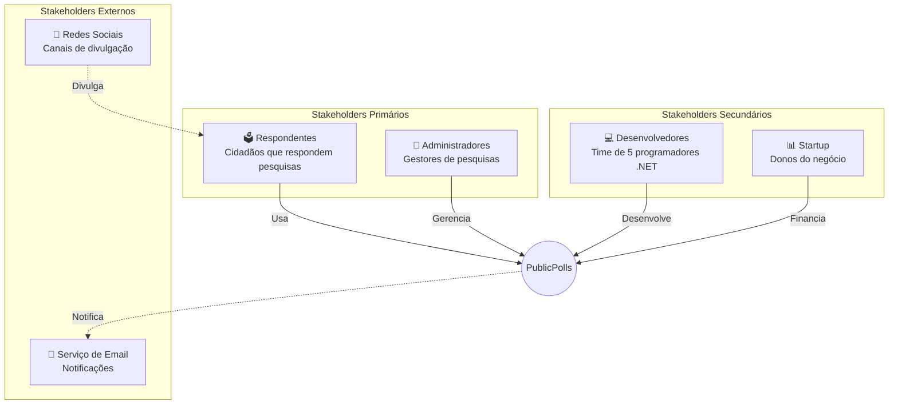
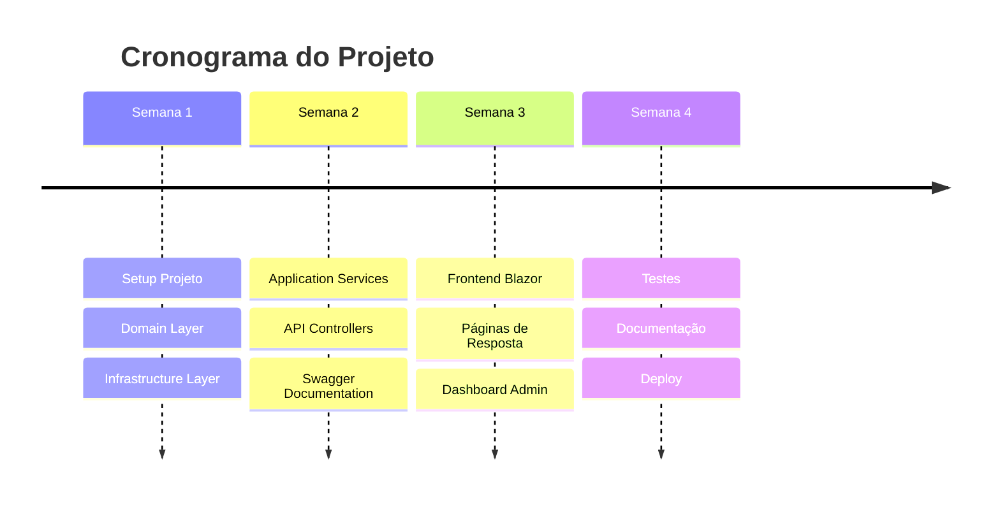
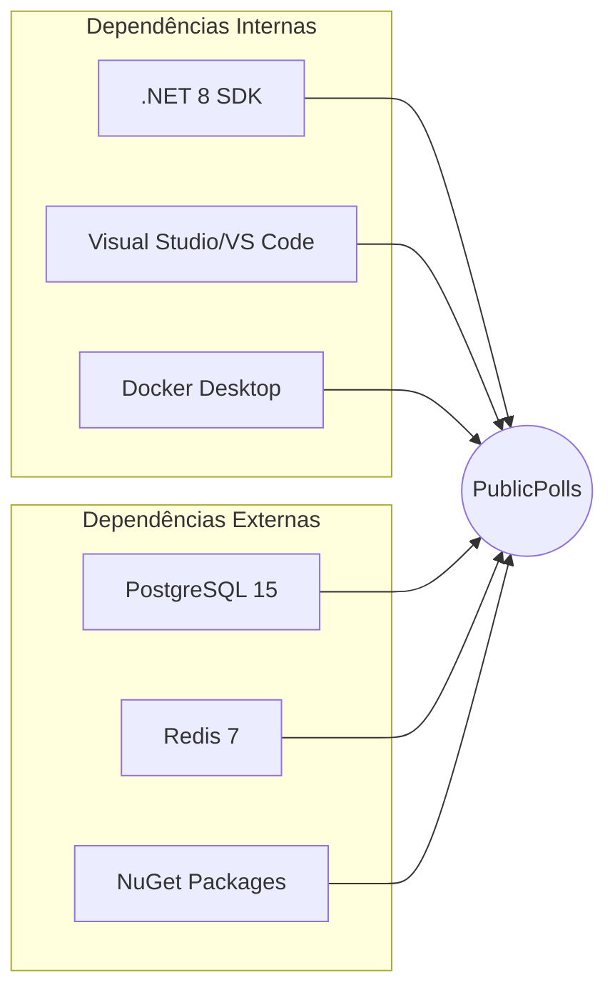

# 📋 Visão Geral do Sistema

## 1. Introdução

### 1.1 Contexto do Projeto

A startup identificou uma oportunidade de mercado no segmento de pesquisas eleitorais digitais. Com o crescimento das redes sociais como canal de comunicação, existe demanda por uma plataforma que permita:

- Criar pesquisas de intenção de voto rapidamente
- Distribuir via anúncios em redes sociais
- Coletar milhões de respostas
- Apresentar resultados sumarizados

### 1.2 Problema a Resolver

---

## 2. Objetivos do Sistema

### 2.1 Objetivos de Negócio

| Objetivo | Descrição | Métrica de Sucesso |
|----------|-----------|-------------------|
| **Escala** | Suportar milhões de respondentes | > 1M respostas/dia |
| **Velocidade** | Resultados em tempo real | Agregação < 5 segundos |
| **Simplicidade** | Interface intuitiva | < 2 minutos para responder |
| **Prazo** | Entrega antes das eleições | Deploy em 4 semanas |

### 2.2 Objetivos Técnicos

---

## 3. Requisitos

### 3.1 Requisitos Funcionais

### 3.2 Requisitos Não-Funcionais

| Categoria | Requisito | Especificação |
|-----------|-----------|---------------|
| **Performance** | RNF01 | Tempo de resposta < 200ms (P95) |
| **Performance** | RNF02 | Suportar 10.000 req/s |
| **Escalabilidade** | RNF03 | Escalar horizontalmente |
| **Disponibilidade** | RNF04 | 99.9% uptime |
| **Segurança** | RNF05 | Autenticação JWT |
| **Segurança** | RNF06 | Rate limiting por IP |
| **Usabilidade** | RNF07 | Responsivo mobile-first |
| **Manutenibilidade** | RNF08 | Cobertura de testes > 70% |

---

## 4. Stakeholders

---

## 5. Restrições do Projeto

### 5.1 Restrições Tecnológicas

> ⚠️ **IMPORTANTE**: Por questões contratuais, a solução DEVE ser desenvolvida utilizando componentes do .NET Framework.

| Restrição | Descrição |
|-----------|-----------|
| Linguagem | C# (obrigatório) |
| Framework Backend | ASP.NET Core (obrigatório) |
| Expertise do Time | 5 desenvolvedores .NET |
| Prazo | 4 semanas até as eleições |

### 5.2 Restrições de Negócio

---

## 6. Escopo

### 6.1 Incluído no Escopo (MVP)

✅ Autenticação de administradores (JWT)
✅ CRUD completo de pesquisas
✅ Perguntas de múltipla escolha
✅ Página pública de resposta
✅ Resultados sumarizados
✅ Cache Redis
✅ Documentação Swagger

### 6.2 Fora do Escopo (Versões Futuras)

❌ Perguntas abertas (texto livre)
❌ Upload de imagens nas perguntas
❌ Exportação de relatórios (Excel/PDF)
❌ Multi-tenancy
❌ Internacionalização (i18n)
❌ Integração com redes sociais (OAuth)

---

## 7. Premissas e Dependências

### 7.1 Premissas

| # | Premissa |
|---|----------|
| P1 | O time possui expertise em .NET/C# |
| P2 | Docker está disponível para desenvolvimento |
| P3 | PostgreSQL e Redis serão usados localmente |
| P4 | Não há requisitos de compliance específicos |

### 7.2 Dependências

---

## 8. Riscos Identificados

| Risco | Probabilidade | Impacto | Mitigação |
|-------|---------------|---------|-----------|
| Prazo apertado | Alta | Crítico | MVP mínimo, sem over-engineering |
| Alta carga simultânea | Média | Alto | Cache Redis, otimização de queries |
| Vulnerabilidades de segurança | Média | Alto | Rate limiting, validações rigorosas |
| Indisponibilidade em pico | Baixa | Crítico | Arquitetura escalável horizontalmente |

---

## Próximo Documento

➡️ [Arquitetura C4](02-arquitetura-c4.md)
