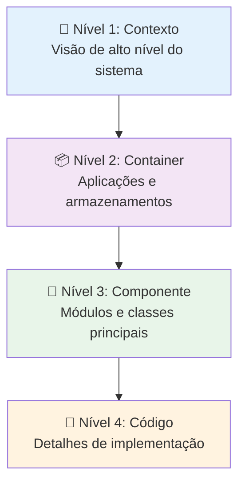
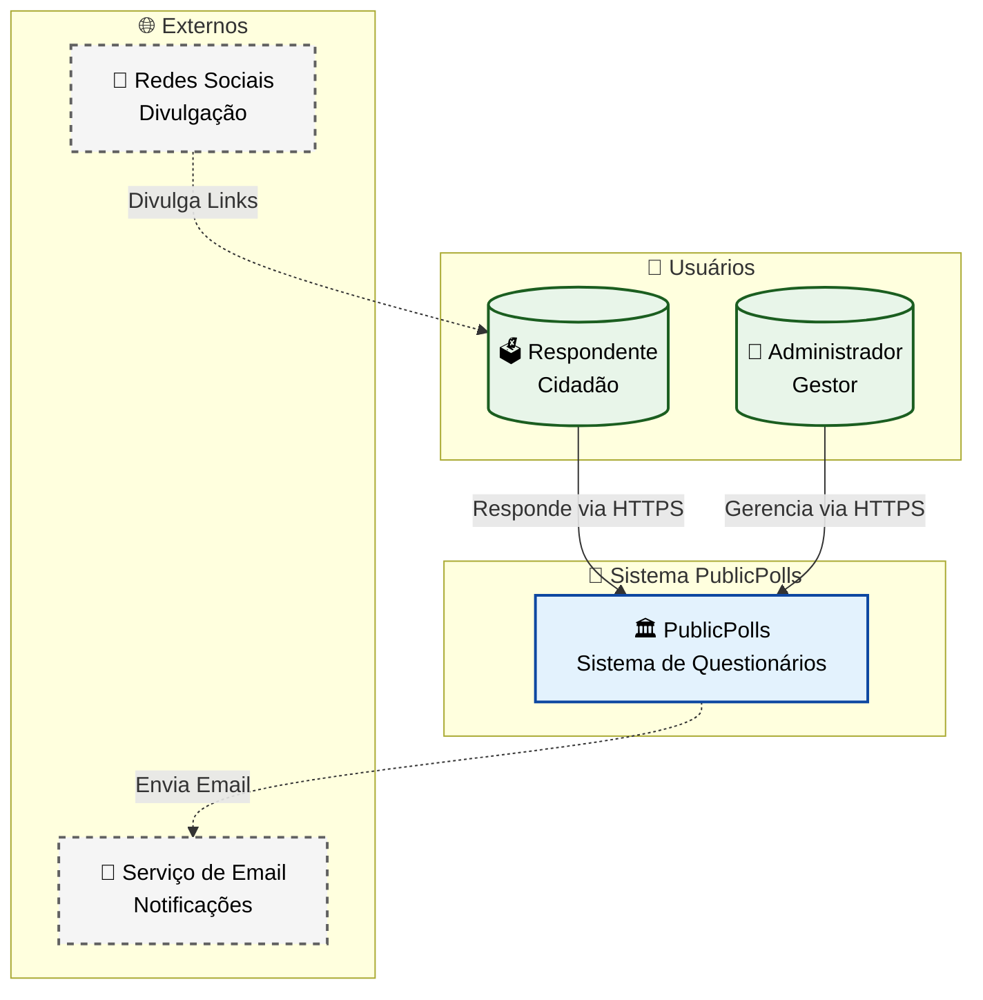
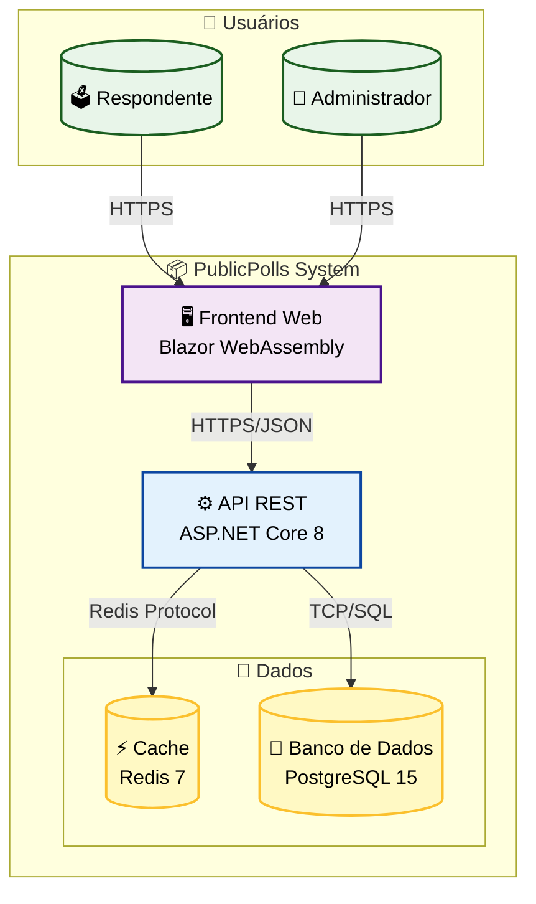
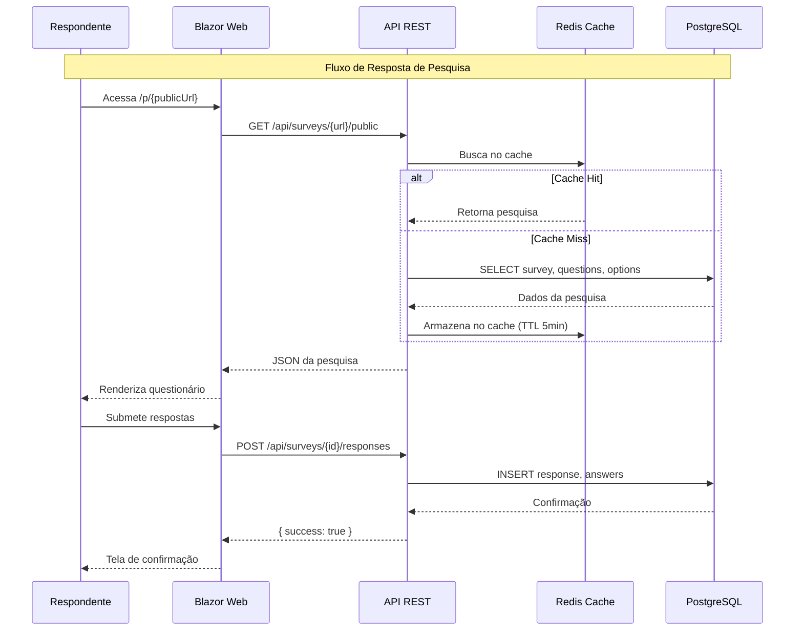
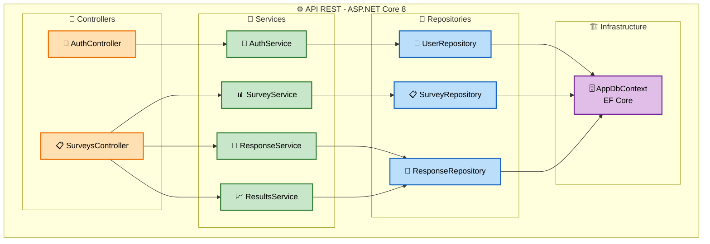
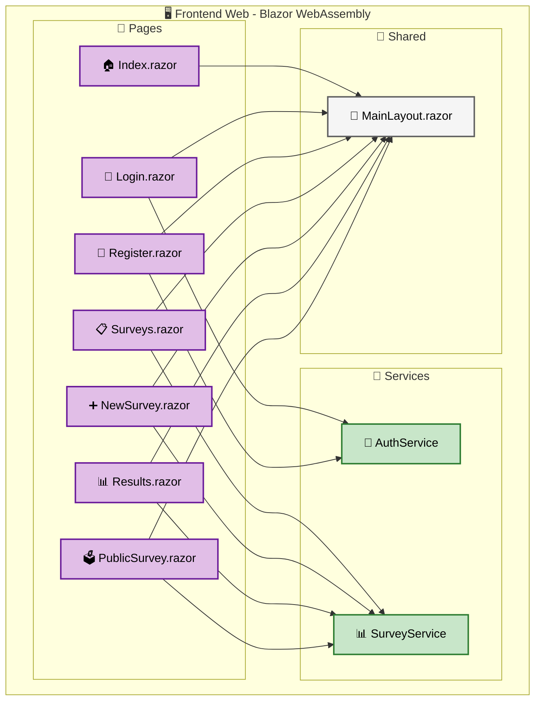
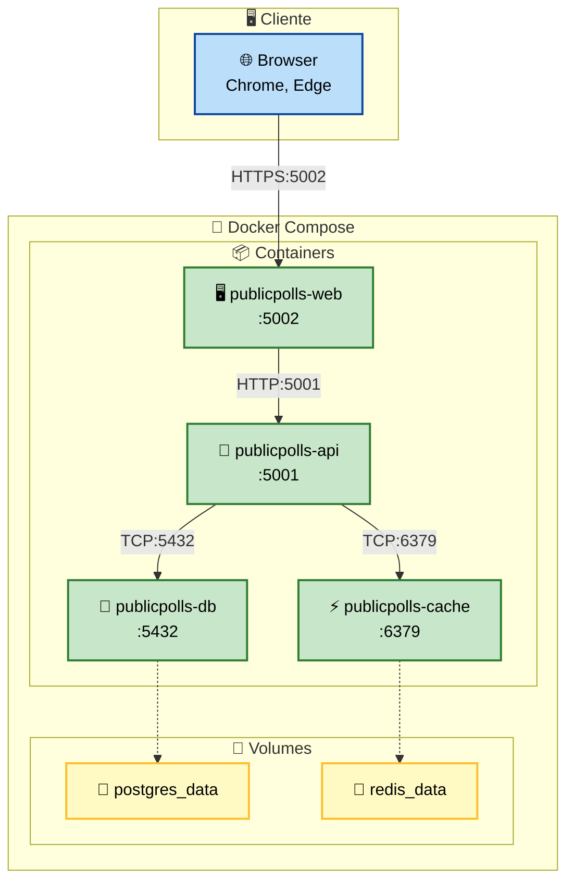

# 🏗️ Arquitetura C4 Model

## 1. Introdução ao C4 Model

O C4 Model é uma abordagem de documentação de arquitetura de software criada por Simon Brown. Consiste em 4 níveis de abstração:

---

## 2. Nível 1: Diagrama de Contexto

### 2.1 Diagrama

### 2.2 Descrição dos Elementos

| Elemento | Tipo | Descrição |
|----------|------|-----------|
| **Respondente** | Pessoa | Cidadão que acessa o link da pesquisa compartilhado nas redes sociais e responde às perguntas |
| **Administrador** | Pessoa | Usuário autenticado que cria pesquisas, gerencia perguntas e visualiza resultados |
| **PublicPolls** | Sistema | Sistema central que gerencia pesquisas de múltipla escolha |
| **Redes Sociais** | Sistema Externo | Canais onde os links das pesquisas são divulgados |
| **Serviço de Email** | Sistema Externo | Serviço SMTP para envio de notificações |

---

## 3. Nível 2: Diagrama de Container

### 3.1 Diagrama

### 3.2 Descrição dos Containers

| Container | Tecnologia | Responsabilidade |
|-----------|------------|------------------|
| **Frontend Web** | Blazor WebAssembly | Interface SPA para respondentes e administradores. Roda no browser usando WebAssembly. |
| **API REST** | ASP.NET Core 8 | Endpoints RESTful para todas as operações. Autenticação via JWT. Documentação via Swagger. |
| **Cache** | Redis 7 | Cache de pesquisas ativas para reduzir carga no banco. Rate limiting por IP. |
| **Banco de Dados** | PostgreSQL 15 | Armazenamento persistente de todos os dados: usuários, pesquisas, perguntas, opções e respostas. |

### 3.3 Fluxo de Dados

---

## 4. Nível 3: Diagrama de Componentes (API)

### 4.1 Diagrama

### 4.2 Descrição dos Componentes

| Camada | Componente | Responsabilidade |
|--------|------------|------------------|
| **Controller** | AuthController | Recebe requisições de autenticação e delega para AuthService |
| **Controller** | SurveysController | Recebe requisições de pesquisas, respostas e resultados |
| **Service** | AuthService | Registro de usuários, validação de credenciais, geração de JWT |
| **Service** | SurveyService | Regras de negócio de pesquisas: criação, atualização, listagem |
| **Service** | ResponseService | Validação e persistência de respostas, controle de duplicatas |
| **Service** | ResultsService | Agregação de respostas e cálculo de percentuais |
| **Repository** | UserRepository | CRUD de usuários via EF Core |
| **Repository** | SurveyRepository | CRUD de pesquisas, perguntas e opções |
| **Repository** | ResponseRepository | Persistência de respostas e consultas agregadas |
| **Infrastructure** | AppDbContext | Configuração do EF Core, mapeamento de entidades |

---

## 5. Nível 3: Diagrama de Componentes (Frontend)

### 5.1 Diagrama

---

## 6. Diagrama de Implantação

---

## Próximo Documento

➡️ [Modelo de Dados](03-modelo-dados.md)
