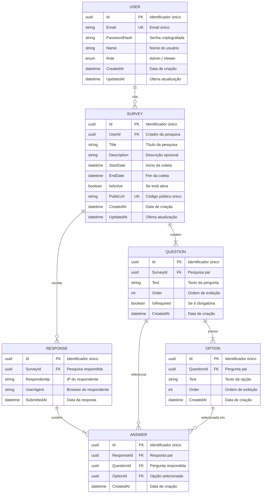
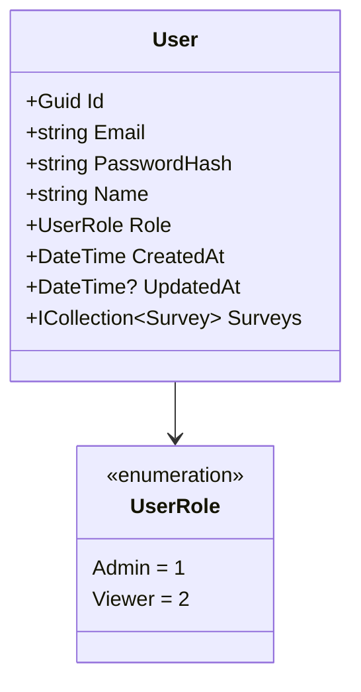
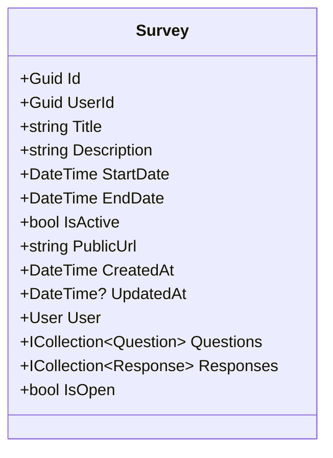
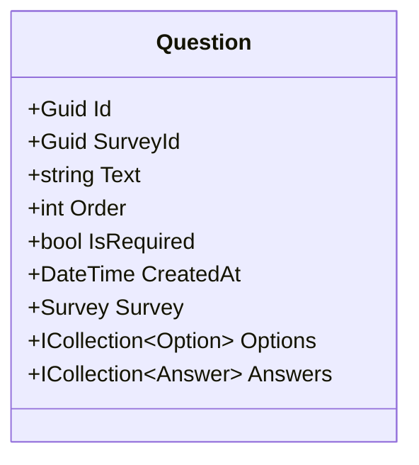
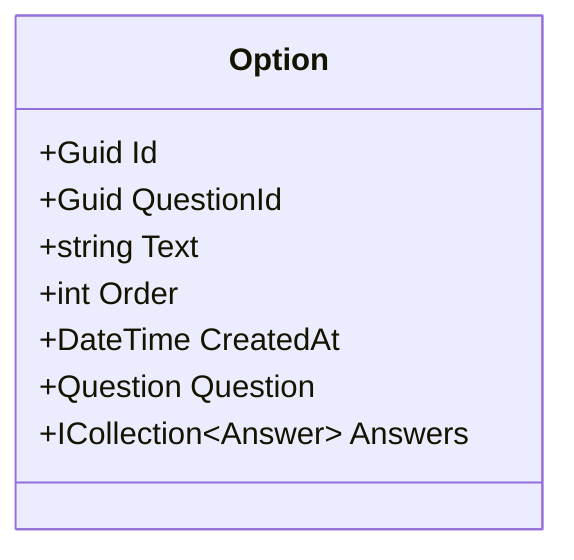
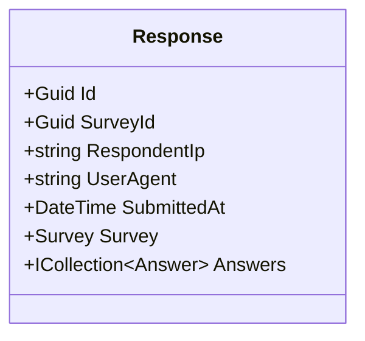
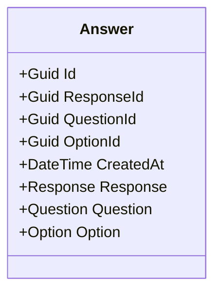
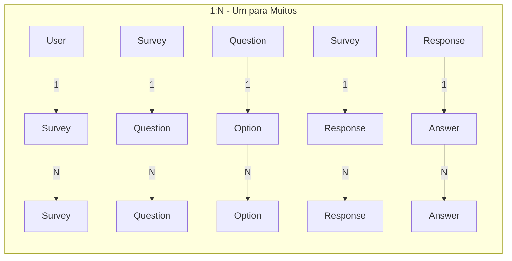
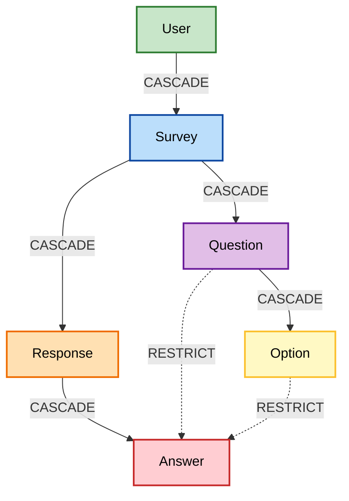
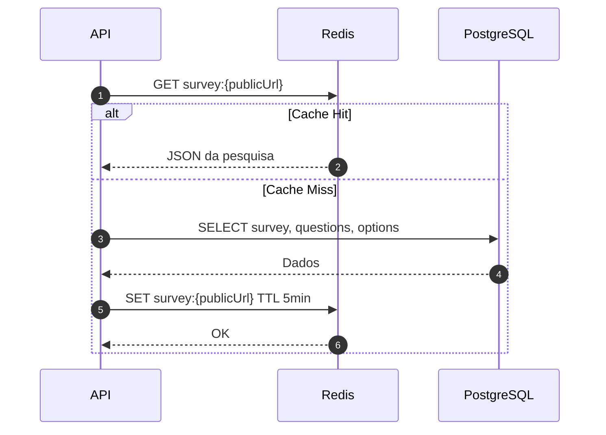

# 💾 Modelo de Dados

## 1. Diagrama Entidade-Relacionamento



---

## 2. Descrição das Entidades

### 2.1 User (Usuário)

Representa um administrador do sistema que pode criar e gerenciar pesquisas.



| Campo | Tipo | Descrição | Restrições |
|-------|------|-----------|------------|
| Id | UUID | Identificador único | PK, Auto-gerado |
| Email | string | Endereço de email | Unique, Required, Max 256 |
| PasswordHash | string | Senha criptografada (SHA256) | Required |
| Name | string | Nome do usuário | Required, Max 100 |
| Role | enum | Papel no sistema | Default: Admin |
| CreatedAt | DateTime | Data de criação | Auto |
| UpdatedAt | DateTime? | Última atualização | Nullable |

### 2.2 Survey (Pesquisa)

Representa uma pesquisa com suas configurações.



| Campo | Tipo | Descrição | Restrições |
|-------|------|-----------|------------|
| Id | UUID | Identificador único | PK |
| UserId | UUID | Criador | FK → User |
| Title | string | Título da pesquisa | Required, Max 200 |
| Description | string | Descrição | Max 1000 |
| StartDate | DateTime | Início da coleta | Required |
| EndDate | DateTime | Fim da coleta | Required |
| IsActive | bool | Se está ativa | Default: true |
| PublicUrl | string | Código público | Unique, Max 50, Auto-gerado |
| IsOpen | bool | Propriedade calculada | StartDate <= now <= EndDate && IsActive |

### 2.3 Question (Pergunta)

Representa uma pergunta de múltipla escolha.



### 2.4 Option (Opção de Resposta)

Representa uma alternativa de resposta.



### 2.5 Response (Submissão de Resposta)

Representa uma submissão completa de um respondente.



### 2.6 Answer (Resposta Individual)

Representa a resposta a uma pergunta específica.



---

## 3. Relacionamentos



| Relacionamento | Cardinalidade | Descrição |
|----------------|---------------|-----------|
| User → Survey | 1:N | Um usuário pode criar várias pesquisas |
| Survey → Question | 1:N | Uma pesquisa tem várias perguntas |
| Question → Option | 1:N | Uma pergunta tem várias opções |
| Survey → Response | 1:N | Uma pesquisa recebe várias respostas |
| Response → Answer | 1:N | Uma submissão tem várias respostas individuais |
| Question → Answer | 1:N | Uma pergunta é referenciada em várias respostas |
| Option → Answer | 1:N | Uma opção pode ser selecionada várias vezes |

---

## 4. Índices e Constraints

### 4.1 Índices

```sql
-- User
CREATE UNIQUE INDEX IX_Users_Email ON Users(Email);

-- Survey
CREATE UNIQUE INDEX IX_Surveys_PublicUrl ON Surveys(PublicUrl);
CREATE INDEX IX_Surveys_UserId ON Surveys(UserId);
CREATE INDEX IX_Surveys_IsActive_StartDate_EndDate ON Surveys(IsActive, StartDate, EndDate);

-- Question
CREATE INDEX IX_Questions_SurveyId ON Questions(SurveyId);

-- Option
CREATE INDEX IX_Options_QuestionId ON Options(QuestionId);

-- Response
CREATE INDEX IX_Responses_SurveyId ON Responses(SurveyId);
CREATE INDEX IX_Responses_SurveyId_RespondentIp ON Responses(SurveyId, RespondentIp);

-- Answer
CREATE INDEX IX_Answers_ResponseId ON Answers(ResponseId);
CREATE INDEX IX_Answers_QuestionId ON Answers(QuestionId);
CREATE INDEX IX_Answers_OptionId ON Answers(OptionId);
```

### 4.2 Constraints de Delete



| FK | On Delete | Justificativa |
|----|-----------|---------------|
| Survey.UserId | CASCADE | Deletar usuário deleta suas pesquisas |
| Question.SurveyId | CASCADE | Deletar pesquisa deleta perguntas |
| Option.QuestionId | CASCADE | Deletar pergunta deleta opções |
| Response.SurveyId | CASCADE | Deletar pesquisa deleta respostas |
| Answer.ResponseId | CASCADE | Deletar resposta deleta answers |
| Answer.QuestionId | RESTRICT | Não deletar pergunta se houver respostas |
| Answer.OptionId | RESTRICT | Não deletar opção se houver respostas |

---

## 5. Queries Importantes

### 5.1 Buscar Pesquisa Pública (Cache-first)



### 5.2 Agregação de Resultados

```sql
SELECT 
    q.Id AS QuestionId,
    q.Text AS QuestionText,
    o.Id AS OptionId,
    o.Text AS OptionText,
    COUNT(a.Id) AS Count,
    ROUND(COUNT(a.Id) * 100.0 / NULLIF(SUM(COUNT(a.Id)) OVER (PARTITION BY q.Id), 0), 2) AS Percentage
FROM Questions q
JOIN Options o ON o.QuestionId = q.Id
LEFT JOIN Answers a ON a.OptionId = o.Id
WHERE q.SurveyId = @SurveyId
GROUP BY q.Id, q.Text, o.Id, o.Text
ORDER BY q.Order, o.Order;
```

---

## Próximo Documento

➡️ [Justificativas Técnicas](04-justificativas-tecnicas.md)
