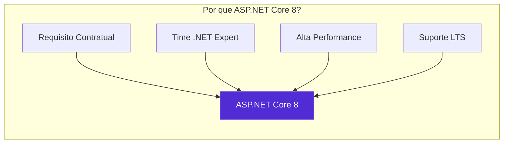
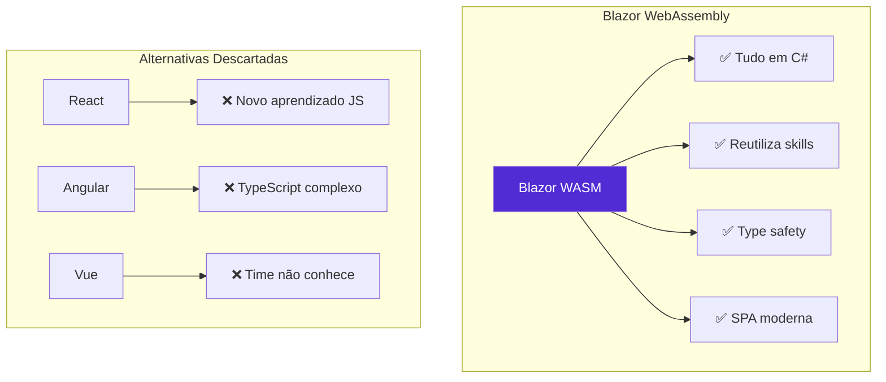
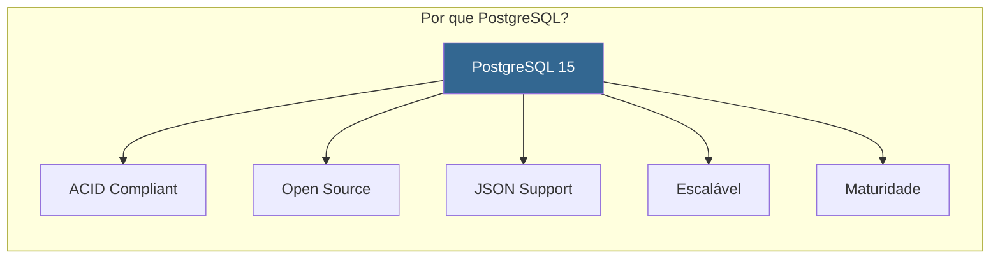
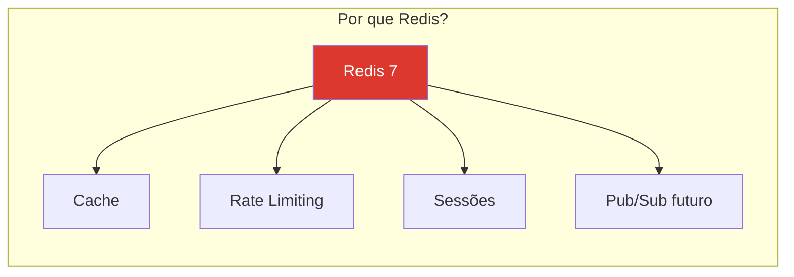
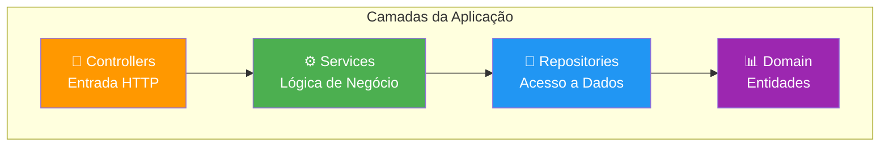
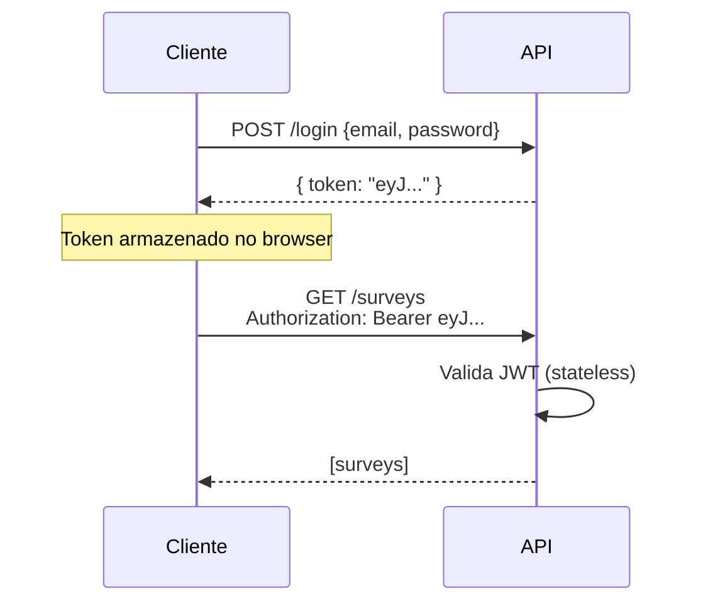
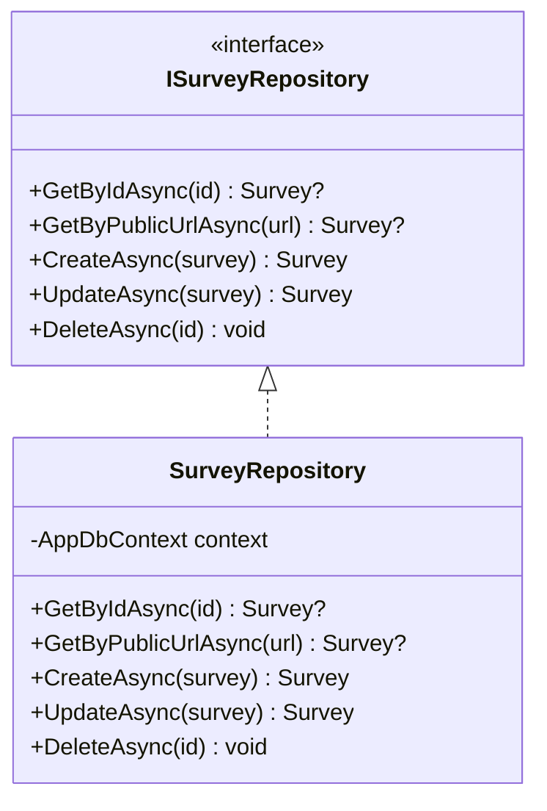
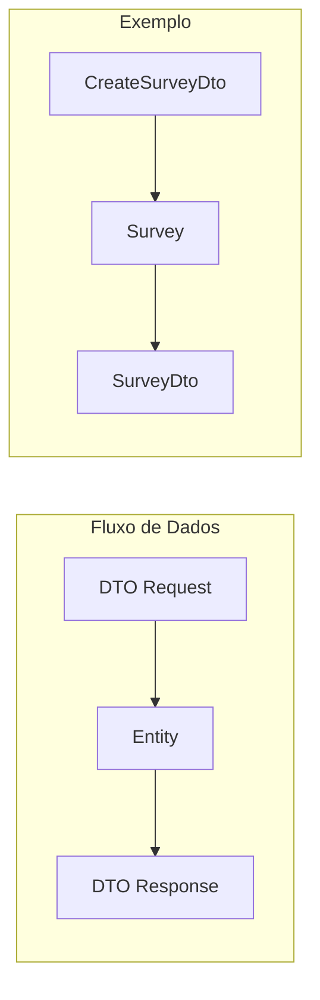
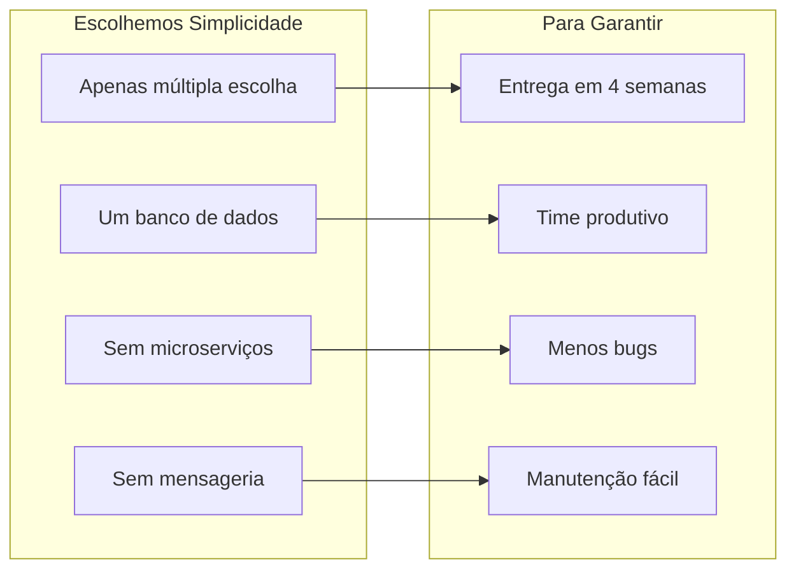

# ⚖️ Justificativas Técnicas

## 1. Introdução

Este documento apresenta as justificativas para cada decisão arquitetural, considerando dois públicos:

1. **Desenvolvedores**: Foco em padrões, manutenibilidade e produtividade
2. **Stakeholders/Usuários**: Foco em benefícios de negócio e confiabilidade

---

## 2. Escolhas de Tecnologia

### 2.1 ASP.NET Core 8



#### 👨‍💻 Para Desenvolvedores

| Aspecto | Benefício |
|---------|-----------|
| **Familiaridade** | Time de 5 devs já conhece C#/.NET |
| **Produtividade** | Scaffolding, DI nativo, middleware pipeline |
| **Performance** | Um dos frameworks web mais rápidos (TechEmpower) |
| **Ecossistema** | NuGet packages maduros e testados |
| **Tooling** | Visual Studio, Hot Reload, debugging poderoso |

#### 👔 Para Stakeholders

> "O ASP.NET Core 8 é utilizado por empresas como Microsoft, Stack Overflow e GoDaddy. É uma tecnologia madura que garante estabilidade e performance para atender milhões de usuários."

---

### 2.2 Blazor WebAssembly



#### 👨‍💻 Para Desenvolvedores

| Aspecto | Benefício |
|---------|-----------|
| **Uma linguagem** | C# no frontend E backend |
| **Compartilhamento** | DTOs e validações reutilizáveis |
| **Tipagem forte** | Erros detectados em compile time |
| **MudBlazor** | Componentes Material prontos |

#### 👔 Para Stakeholders

> "Usar Blazor significa que TODOS os 5 desenvolvedores podem trabalhar em qualquer parte do sistema, sem dividir o time entre 'frontend' e 'backend'. Isso acelera a entrega."

---

### 2.3 PostgreSQL



#### 👨‍💻 Para Desenvolvedores

| Aspecto | Benefício |
|---------|-----------|
| **EF Core Support** | Provider oficial e estável |
| **Migrations** | Code-first com suporte completo |
| **Performance** | Índices avançados, particionamento |
| **JSON Native** | jsonb para dados flexíveis |

#### 👔 Para Stakeholders

> "PostgreSQL é gratuito (open source) e usado por empresas como Apple, Instagram e Spotify. Oferece garantias de consistência de dados essenciais para pesquisas eleitorais."

---

### 2.4 Redis



#### 👨‍💻 Para Desenvolvedores

| Aspecto | Benefício |
|---------|-----------|
| **IDistributedCache** | Interface padrão do .NET |
| **Simplicidade** | Key-value com TTL |
| **Performance** | Sub-millisecond latency |
| **Escalável** | Cluster mode disponível |

#### 👔 Para Stakeholders

> "O Redis mantém as pesquisas mais acessadas em memória, permitindo que milhões de pessoas acessem simultaneamente sem sobrecarregar o banco de dados."

---

## 3. Decisões Arquiteturais

### 3.1 Clean Architecture Simplificada



#### 👨‍💻 Para Desenvolvedores

**Por que Clean Architecture?**

1. **Separação de Responsabilidades**
   - Controllers: HTTP, validação, serialização
   - Services: Regras de negócio
   - Repositories: Acesso a dados
   - Domain: Entidades puras

2. **Testabilidade**
   ```csharp
   // Services podem ser testados com mocks
   var mockRepo = new Mock<ISurveyRepository>();
   var service = new SurveyService(mockRepo.Object);
   ```

3. **Inversão de Dependência**
   - Interfaces no Domain
   - Implementações no Infrastructure
   - DI configurado no Program.cs

**Por que NÃO full Clean Architecture?**

| Descartado | Motivo |
|------------|--------|
| Use Cases separados | Overhead para projeto de 4 semanas |
| Presenters | Blazor já é tipado |
| Gateways | Apenas um banco |

#### 👔 Para Stakeholders

> "A arquitetura em camadas permite que diferentes desenvolvedores trabalhem em paralelo sem conflitos. Enquanto um cria a interface, outro pode implementar as regras de negócio."

---

### 3.2 JWT para Autenticação



#### 👨‍💻 Para Desenvolvedores

| Aspecto | Benefício |
|---------|-----------|
| **Stateless** | Não precisa de session store |
| **Escalável** | Qualquer instância valida |
| **Padrão** | Integração com ASP.NET Identity |
| **Claims** | UserId e Role no token |

#### 👔 Para Stakeholders

> "JWT é o padrão de autenticação usado por 90% das APIs modernas. É seguro, escalável e não precisa de infraestrutura adicional para gerenciar sessões."

---

### 3.3 Repository Pattern



#### 👨‍💻 Para Desenvolvedores

**Benefícios:**
- Abstração do EF Core
- Facilita testes unitários
- Centraliza queries complexas
- Permite troca de ORM no futuro

**Trade-offs:**
- Não é necessário para CRUD simples
- Mas justifica para queries específicas (e.g., `GetByPublicUrlAsync`)

---

### 3.4 DTOs e Mapeamento



#### 👨‍💻 Para Desenvolvedores

**Por que DTOs?**

1. **Segurança**: Não expõe entidades diretamente
2. **Flexibilidade**: API pode evoluir sem mudar DB
3. **Performance**: Retorna apenas campos necessários
4. **Validação**: DataAnnotations nos DTOs

---

## 4. Trade-offs Aceitos

### 4.1 Simplicidade vs Flexibilidade



### 4.2 Decisões Futuras Adiadas

| Decisão | Status | Quando Implementar |
|---------|--------|-------------------|
| Perguntas abertas | Adiado | Versão 2.0 |
| RabbitMQ | Adiado | Se escala exigir |
| Kubernetes | Adiado | Se escalar além do Docker |
| Multi-tenancy | Adiado | Novos clientes |

---

## 5. Resumo Executivo

### Para Stakeholders

> **O sistema foi construído com tecnologias comprovadas e familiares ao time, priorizando:**
>
> 1. ✅ **Prazo**: Entrega em 4 semanas
> 2. ✅ **Escala**: Suporta milhões de respostas
> 3. ✅ **Confiabilidade**: PostgreSQL garante consistência
> 4. ✅ **Performance**: Redis acelera acessos
> 5. ✅ **Manutenibilidade**: Arquitetura em camadas

---

## Próximo Documento

➡️ [Escalabilidade](05-escalabilidade.md)
