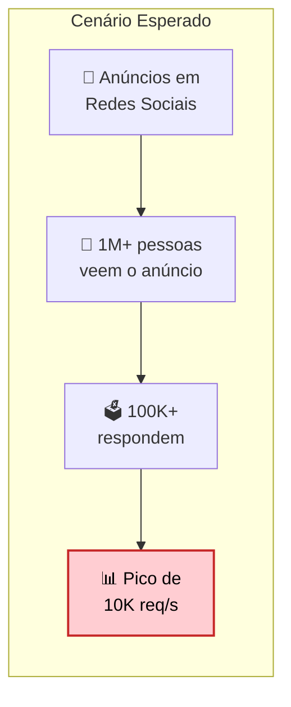
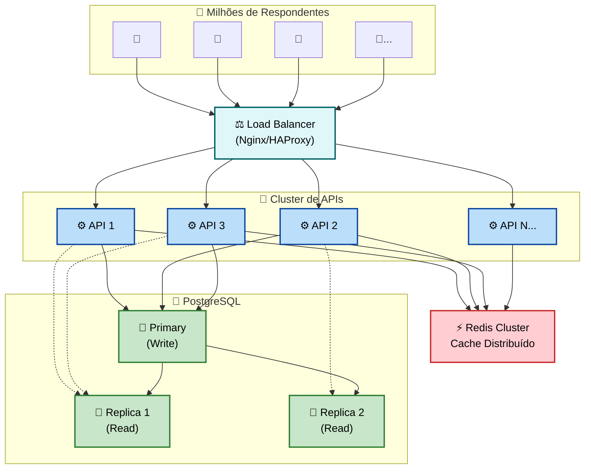
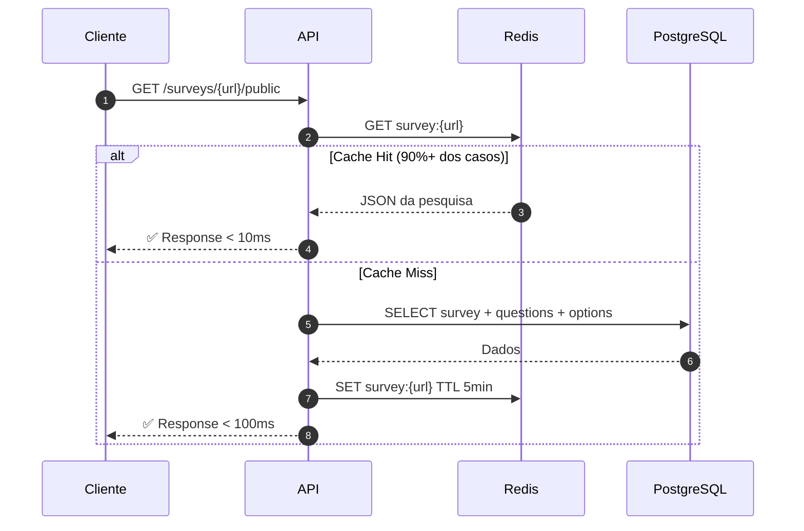
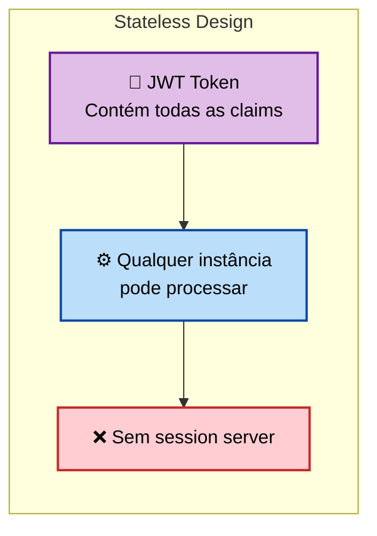
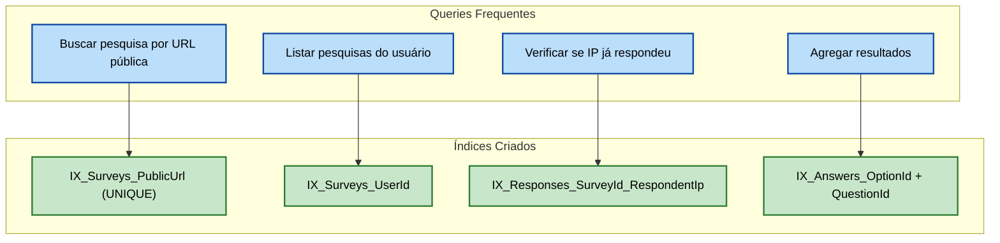
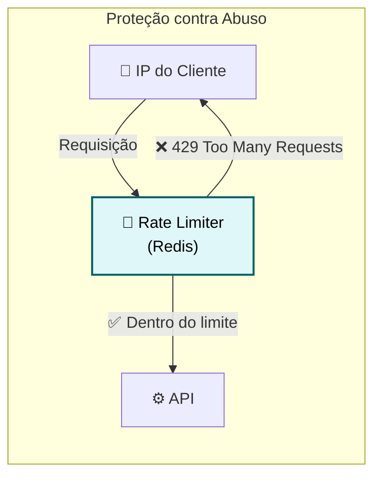
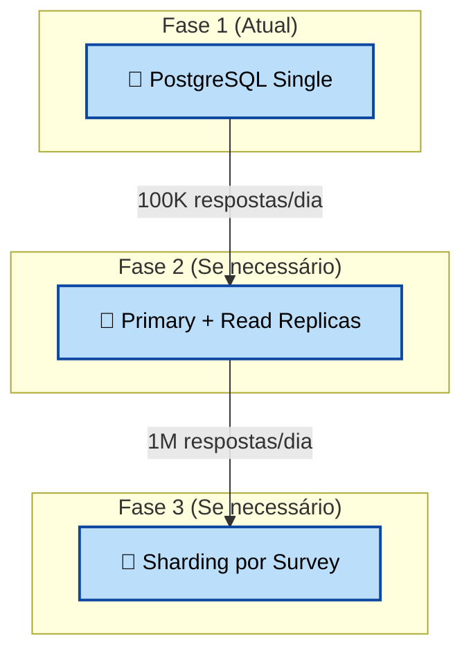
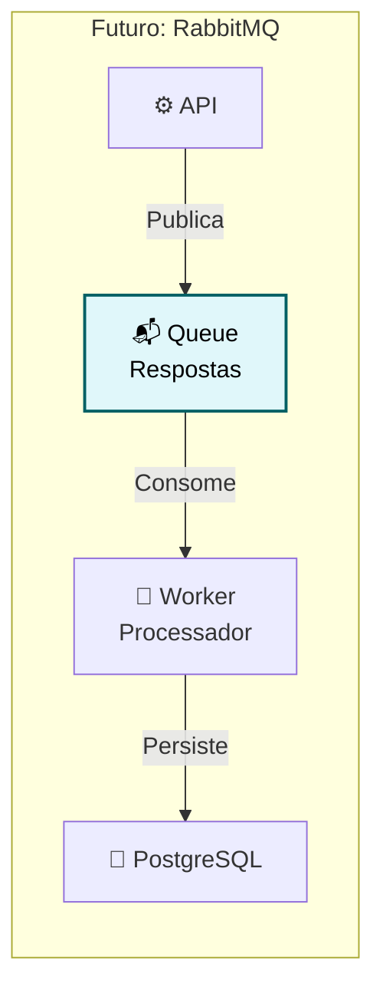

# 📈 Estratégias de Escalabilidade

## 1. Cenário de Carga

### 1.1 Requisitos de Volume



| Métrica | Valor Esperado | Crítico |
|---------|----------------|---------|
| Usuários diários | 100.000 | Suportar pico |
| Requisições/segundo (pico) | 10.000 | Performance crítica |
| Tamanho médio resposta | 5 KB | Otimizar payload |
| Tempo de resposta (P95) | < 200ms | UX aceitável |

---

## 2. Arquitetura Escalável

### 2.1 Diagrama de Escala Horizontal



---

## 3. Estratégias Implementadas

### 3.1 Cache Redis (Cache-First Pattern)



**Configuração:**
```csharp
services.AddStackExchangeRedisCache(options =>
{
    options.Configuration = "localhost:6379";
    options.InstanceName = "PublicPolls_";
});
```

**Benefícios:**
| Métrica | Sem Cache | Com Cache |
|---------|-----------|-----------|
| Latência média | 50ms | 5ms |
| Carga no DB | 100% | 10% |
| Throughput | 1K req/s | 10K req/s |

---

### 3.2 API Stateless



**Por que stateless?**
- Qualquer instância pode processar qualquer requisição
- Fácil escalar horizontalmente
- Não precisa de sticky sessions
- Load balancer pode usar round-robin

---

### 3.3 Índices Otimizados



---

### 3.4 Rate Limiting



**Regras:**
| Endpoint | Limite | Janela |
|----------|--------|--------|
| POST /responses | 1 por survey | Por IP |
| GET /surveys/public | 100 | Por minuto |
| POST /auth/login | 5 | Por minuto |

---

## 4. Estratégias Futuras (Não Implementadas)

### 4.1 Escalabilidade do Banco de Dados



### 4.2 Mensageria Assíncrona



**Quando implementar:**
- Se latência de escrita > 100ms
- Se perda de respostas for inaceitável
- Se precisar de retry automático

---

## 5. Monitoramento (Recomendado)

### 5.1 Métricas Importantes

graph TB
    root("📊 Métricas")

    subgraph "🚀 Performance"
        P1["Response Time P50"]
        P2["Response Time P95"]
        P3["Response Time P99"]
        P4["Throughput req/s"]
    end

    subgraph "🆙 Disponibilidade"
        D1["Uptime %"]
        D2["Error Rate %"]
        D3["Circuit Breaker status"]
    end

    subgraph "💾 Recursos"
        R1["CPU %"]
        R2["Memory %"]
        R3["DB connections"]
        R4["Redis memory"]
    end

    subgraph "💼 Negócio"
        N1["Respostas/hora"]
        N2["Pesquisas ativas"]
        N3["Usuários únicos"]
    end

    root --> P1
    root --> D1
    root --> R1
    root --> N1

    P1 ~~~ P2 ~~~ P3 ~~~ P4
    D1 ~~~ D2 ~~~ D3
    R1 ~~~ R2 ~~~ R3 ~~~ R4
    N1 ~~~ N2 ~~~ N3

    %% Styling
    classDef root fill:#212121,stroke:#000,color:#fff,stroke-width:2px;
    classDef perf fill:#bbdefb,stroke:#0d47a1,color:#000,stroke-width:2px;
    classDef avail fill:#c8e6c9,stroke:#2e7d32,color:#000,stroke-width:2px;
    classDef res fill:#ffe0b2,stroke:#ef6c00,color:#000,stroke-width:2px;
    classDef biz fill:#e1bee7,stroke:#6a1b9a,color:#000,stroke-width:2px;

    class root root;
    class P1,P2,P3,P4 perf;
    class D1,D2,D3 avail;
    class R1,R2,R3,R4 res;
    class N1,N2,N3 biz;

### 5.2 Stack Recomendada

| Componente | Ferramenta | Propósito |
|------------|------------|-----------|
| APM | Application Insights | Traces, métricas |
| Logs | Serilog + Seq | Log agregado |
| Dashboard | Grafana | Visualização |
| Alertas | PagerDuty | Notificações |

---

## 6. Estimativas de Capacidade

### 6.1 Cenário: Dia da Eleição

```mermaid
gantt
    title Carga Esperada - Dia da Eleição
    dateFormat HH:mm
    axisFormat %H:%M

    section Manhã
    Pico 1 (8h)    :active, 08:00, 2h
    Normal          :09:00, 3h

    section Tarde
    Pico 2 (12h)   :crit, 12:00, 2h
    Normal          :14:00, 4h

    section Noite
    Pico 3 (19h)   :crit, 19:00, 3h
    Queda           :22:00, 2h
```



### 6.2 Dimensionamento

| Carga | Instâncias API | Redis | PostgreSQL |
|-------|----------------|-------|------------|
| 1K req/s | 2 | 1 (256MB) | 1 (2 vCPU) |
| 5K req/s | 4 | 1 (512MB) | 1 (4 vCPU) |
| 10K req/s | 8 | 3 (Cluster) | 1 + 2 Replicas |
| 50K req/s | 20 | 6 (Cluster) | Sharding |

---

## Próximo Documento

➡️ [Referência da API](06-api-reference.md)
