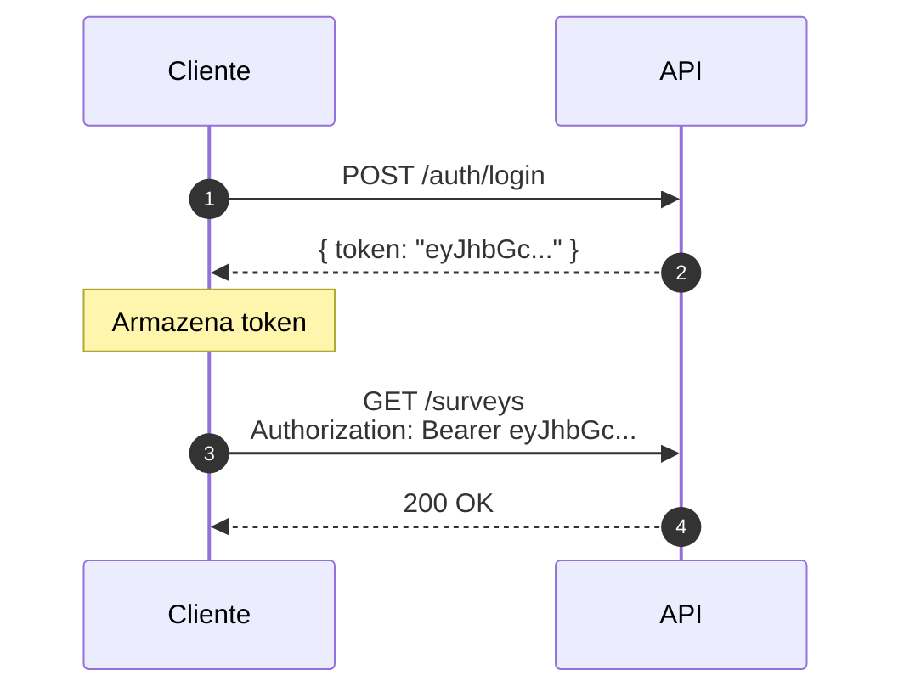
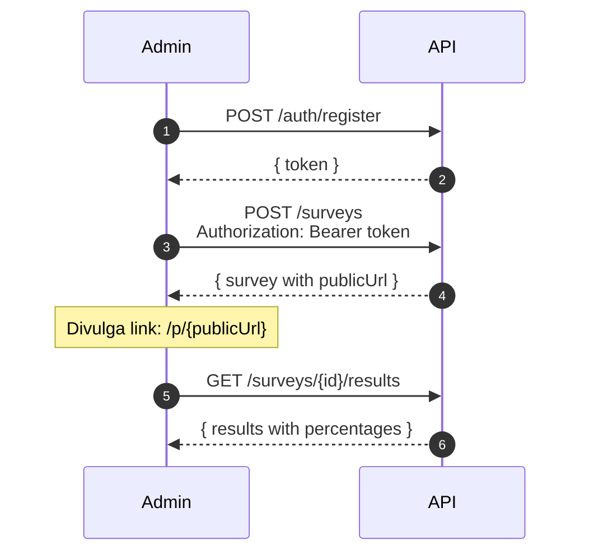
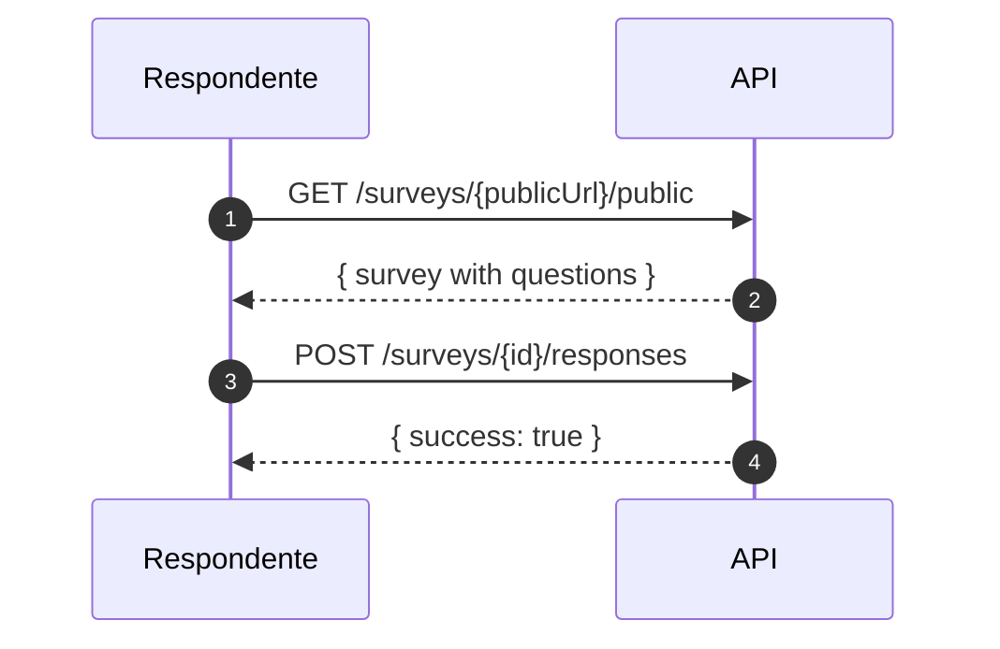

# 🔌 Referência da API

## 1. Visão Geral

### 1.1 Base URL

```
https://localhost:5001/api
```

### 1.2 Autenticação

A API utiliza **JWT Bearer Token** para autenticação.



**Header de Autenticação:**
```http
Authorization: Bearer <token>
```

### 1.3 Códigos de Resposta

| Código | Significado |
|--------|------------|
| `200` | Sucesso |
| `201` | Criado com sucesso |
| `204` | Sem conteúdo (delete) |
| `400` | Requisição inválida |
| `401` | Não autenticado |
| `403` | Não autorizado |
| `404` | Não encontrado |
| `429` | Rate limit excedido |
| `500` | Erro interno |

---

## 2. Endpoints de Autenticação

### 2.1 Registrar Usuário

```http
POST /api/auth/register
```

**Request Body:**
```json
{
    "email": "admin@example.com",
    "password": "senha123",
    "name": "Administrador"
}
```

**Response 200:**
```json
{
    "success": true,
    "token": "eyJhbGciOiJIUzI1NiIsInR5cCI6IkpXVCJ9...",
    "user": {
        "id": "3fa85f64-5717-4562-b3fc-2c963f66afa6",
        "email": "admin@example.com",
        "name": "Administrador",
        "role": "Admin"
    }
}
```

**Response 400:**
```json
{
    "success": false,
    "error": "Email já está em uso"
}
```

---

### 2.2 Login

```http
POST /api/auth/login
```

**Request Body:**
```json
{
    "email": "admin@example.com",
    "password": "senha123"
}
```

**Response 200:**
```json
{
    "success": true,
    "token": "eyJhbGciOiJIUzI1NiIsInR5cCI6IkpXVCJ9...",
    "user": {
        "id": "3fa85f64-5717-4562-b3fc-2c963f66afa6",
        "email": "admin@example.com",
        "name": "Administrador",
        "role": "Admin"
    }
}
```

**Response 401:**
```json
{
    "success": false,
    "error": "Credenciais inválidas"
}
```

---

## 3. Endpoints de Pesquisas

### 3.1 Listar Pesquisas

```http
GET /api/surveys
Authorization: Bearer <token>
```

**Response 200:**
```json
[
    {
        "id": "3fa85f64-5717-4562-b3fc-2c963f66afa6",
        "title": "Pesquisa Eleitoral 2024",
        "startDate": "2024-01-01T00:00:00Z",
        "endDate": "2024-12-31T23:59:59Z",
        "isActive": true,
        "publicUrl": "abc12345",
        "isOpen": true,
        "responseCount": 1250
    }
]
```

---

### 3.2 Criar Pesquisa

```http
POST /api/surveys
Authorization: Bearer <token>
Content-Type: application/json
```

**Request Body:**
```json
{
    "title": "Pesquisa Eleitoral 2024",
    "description": "Pesquisa de intenção de voto para prefeito",
    "startDate": "2024-01-01T00:00:00Z",
    "endDate": "2024-12-31T23:59:59Z",
    "questions": [
        {
            "text": "Em quem você pretende votar para prefeito?",
            "order": 1,
            "isRequired": true,
            "options": [
                { "text": "Candidato A", "order": 1 },
                { "text": "Candidato B", "order": 2 },
                { "text": "Candidato C", "order": 3 },
                { "text": "Nulo/Branco", "order": 4 },
                { "text": "Indeciso", "order": 5 }
            ]
        },
        {
            "text": "Qual sua faixa etária?",
            "order": 2,
            "isRequired": true,
            "options": [
                { "text": "18-25 anos", "order": 1 },
                { "text": "26-35 anos", "order": 2 },
                { "text": "36-50 anos", "order": 3 },
                { "text": "51+ anos", "order": 4 }
            ]
        }
    ]
}
```

**Response 201:**
```json
{
    "id": "3fa85f64-5717-4562-b3fc-2c963f66afa6",
    "title": "Pesquisa Eleitoral 2024",
    "description": "Pesquisa de intenção de voto para prefeito",
    "startDate": "2024-01-01T00:00:00Z",
    "endDate": "2024-12-31T23:59:59Z",
    "isActive": true,
    "publicUrl": "abc12345",
    "isOpen": true,
    "questions": [...]
}
```

---

### 3.3 Obter Pesquisa por ID

```http
GET /api/surveys/{id}
Authorization: Bearer <token>
```

**Response 200:**
```json
{
    "id": "3fa85f64-5717-4562-b3fc-2c963f66afa6",
    "title": "Pesquisa Eleitoral 2024",
    "description": "Pesquisa de intenção de voto",
    "startDate": "2024-01-01T00:00:00Z",
    "endDate": "2024-12-31T23:59:59Z",
    "isActive": true,
    "publicUrl": "abc12345",
    "isOpen": true,
    "questions": [
        {
            "id": "question-uuid-1",
            "text": "Em quem você pretende votar?",
            "order": 1,
            "isRequired": true,
            "options": [
                { "id": "option-uuid-1", "text": "Candidato A", "order": 1 },
                { "id": "option-uuid-2", "text": "Candidato B", "order": 2 }
            ]
        }
    ]
}
```

---

### 3.4 Obter Pesquisa Pública

```http
GET /api/surveys/{publicUrl}/public
```

> ⚠️ **Não requer autenticação** - Este é o endpoint usado pelos respondentes.

**Response 200:** (mesmo formato do endpoint anterior)

**Response 404:**
```json
{
    "error": "Pesquisa não encontrada ou não está aberta"
}
```

---

### 3.5 Atualizar Pesquisa

```http
PUT /api/surveys/{id}
Authorization: Bearer <token>
Content-Type: application/json
```

**Request Body:**
```json
{
    "title": "Pesquisa Eleitoral 2024 - Atualizada",
    "isActive": false
}
```

**Response 200:** Pesquisa atualizada

---

### 3.6 Excluir Pesquisa

```http
DELETE /api/surveys/{id}
Authorization: Bearer <token>
```

**Response 204:** Sem conteúdo

---

## 4. Endpoints de Respostas

### 4.1 Submeter Resposta

```http
POST /api/surveys/{id}/responses
Content-Type: application/json
```

> ⚠️ **Não requer autenticação** - Endpoint público para respondentes.

**Request Body:**
```json
{
    "answers": [
        {
            "questionId": "question-uuid-1",
            "optionId": "option-uuid-1"
        },
        {
            "questionId": "question-uuid-2",
            "optionId": "option-uuid-5"
        }
    ]
}
```

**Response 200:**
```json
{
    "success": true,
    "responseId": "response-uuid"
}
```

**Response 400:**
```json
{
    "success": false,
    "error": "Você já respondeu esta pesquisa"
}
```

---

### 4.2 Obter Resultados

```http
GET /api/surveys/{id}/results
Authorization: Bearer <token>
```

**Response 200:**
```json
{
    "surveyId": "3fa85f64-5717-4562-b3fc-2c963f66afa6",
    "title": "Pesquisa Eleitoral 2024",
    "totalResponses": 1250,
    "questions": [
        {
            "questionId": "question-uuid-1",
            "text": "Em quem você pretende votar?",
            "totalAnswers": 1250,
            "options": [
                {
                    "optionId": "option-uuid-1",
                    "text": "Candidato A",
                    "count": 450,
                    "percentage": 36.0
                },
                {
                    "optionId": "option-uuid-2",
                    "text": "Candidato B",
                    "count": 380,
                    "percentage": 30.4
                },
                {
                    "optionId": "option-uuid-3",
                    "text": "Candidato C",
                    "count": 220,
                    "percentage": 17.6
                },
                {
                    "optionId": "option-uuid-4",
                    "text": "Nulo/Branco",
                    "count": 100,
                    "percentage": 8.0
                },
                {
                    "optionId": "option-uuid-5",
                    "text": "Indeciso",
                    "count": 100,
                    "percentage": 8.0
                }
            ]
        }
    ]
}
```

---

## 5. Fluxos de Uso

### 5.1 Fluxo do Administrador



### 5.2 Fluxo do Respondente



---

## 6. Swagger UI

A documentação interativa está disponível em:

```
https://localhost:5001/swagger
```

### Funcionalidades:
- Testar todos os endpoints
- Visualizar schemas
- Autenticar via JWT
- Baixar OpenAPI spec

---

## 📚 Documentação Completa

| Documento | Link |
|-----------|------|
| Visão Geral | [01-visao-geral.md](01-visao-geral.md) |
| Arquitetura C4 | [02-arquitetura-c4.md](02-arquitetura-c4.md) |
| Modelo de Dados | [03-modelo-dados.md](03-modelo-dados.md) |
| Justificativas | [04-justificativas-tecnicas.md](04-justificativas-tecnicas.md) |
| Escalabilidade | [05-escalabilidade.md](05-escalabilidade.md) |
| **API Reference** | Este documento |
